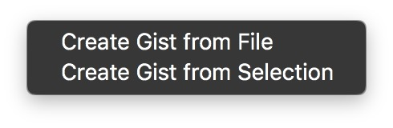

# Xgist
Xgist is a Xcode extension to send code to GitHub's Gist.
The extension will send your selection or entire file to Gist and automatically copy the Gist URL into your Clipboard. 

Be aware that it will replace your current clipboard with the Gist URL!

If you prefer, the binary (unsigned) is [here](https://github.com/Bunn/Xgist/releases/latest)

[Youtube demo video] (https://youtu.be/LtyPq-bzjM0)

# Installation

Easy way
--------
1. Download the (unsigned) binary [here](https://github.com/Bunn/Xgist/releases/latest) ;
2. Unzip it and drag it to you Applications folder;
3. Right click the Xgist.app and click 'Open';
4. Xgist macOS app will open and install the extension;
5. Close Xgist.app;
5. Done.

"Hard" way
------------
1. Clone the repo and open ``Xgist.xcodeproj``;
2. Enable target signing for both the Application and the Source Code Extension using your own developer ID;
3. Product > Archive;
4. Right click archive > Show in Finder;
5. Right click archive > Show Package Contents;
6. Open Products/Applications;
7. Drag ``Xgist.app`` to your Applications folder and double click on it;
8. Xgist macOS app will open and install the extension;
9. Close Xgist.app
10. Done.