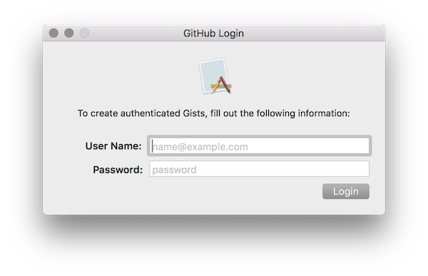
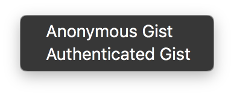
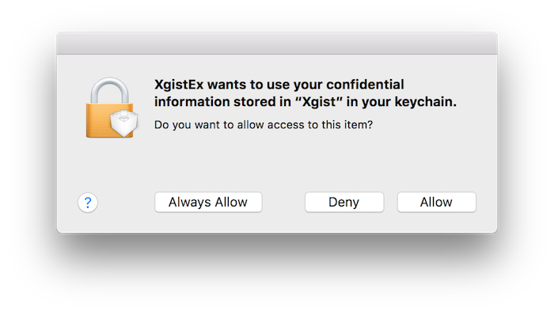
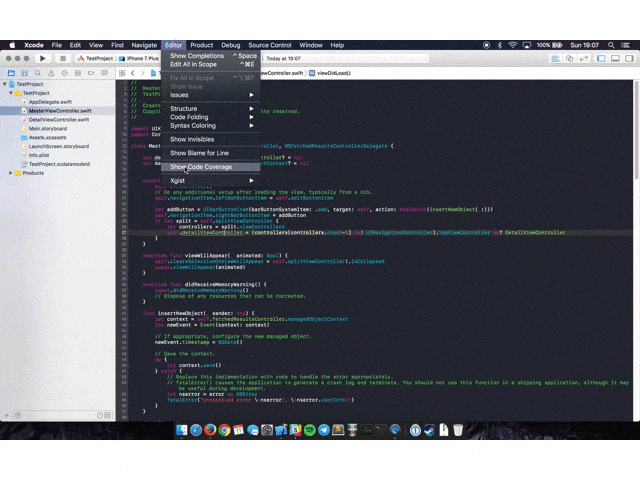
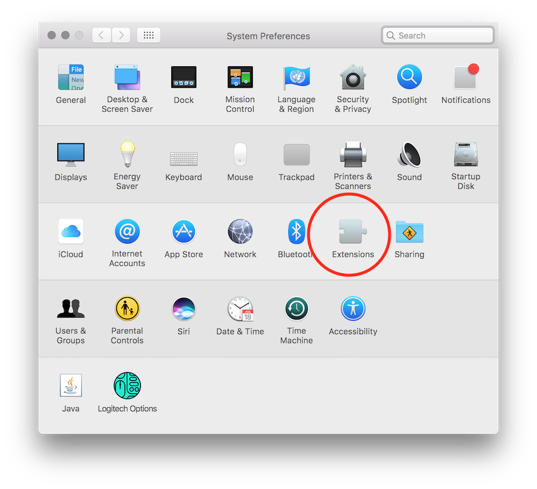
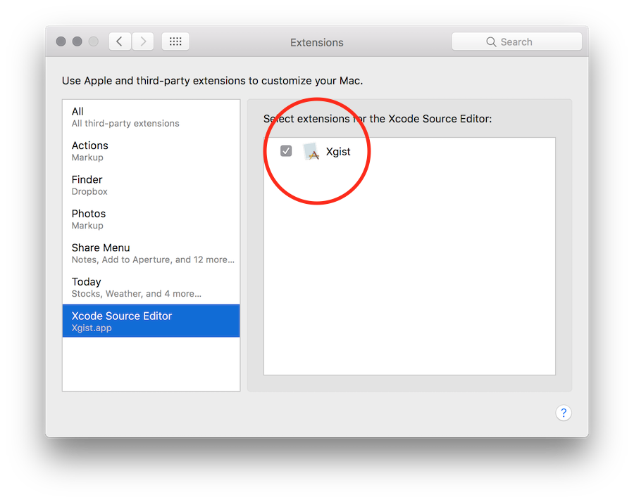

# Xgist
Xgist is a Xcode extension to send code to GitHub's Gist.
The extension will send your code selection to Gist and automatically copy the Gist URL into your Clipboard. 

Be aware that it will replace your current clipboard with the Gist URL!

# Authentication (Optional)
By default Xgist will post your gists as anonymous, but once you open the .app you'll see a login form where you can login to your GitHub account and post authenticated gists.

After you login you'll need to restart Xcode so it will give you the authenticated gist option

Note that Xcode might ask to use your keychain since that's how your GitHub access token is stored.

[Youtube demo video](https://youtu.be/LtyPq-bzjM0)

# Installation

# Easy way
Thanks to [Rambo](https://twitter.com/_inside) you can download a signed version of the app [here](https://github.com/Bunn/Xgist/releases/latest):

After opening it, you might need to go to the system preferences app and enable Xgist plugin.

# Manual way
*Note that by choosing this way you'll need to create your own GitHub app and add your app ID and Secret into the `GitHubCredential.swift` file*

1. Clone the repo and open ``Xgist.xcodeproj``;
2. Enable target signing for both the Application and the Source Code Extension using your own developer ID;
3. Product > Archive;
4. Right click archive > Show in Finder;
5. Right click archive > Show Package Contents;
6. Open Products/Applications;
7. Drag ``Xgist.app`` to your Applications folder and double click on it;
8. Xgist macOS app will open and install the extension;
9. Close Xgist.app
10. Done.
